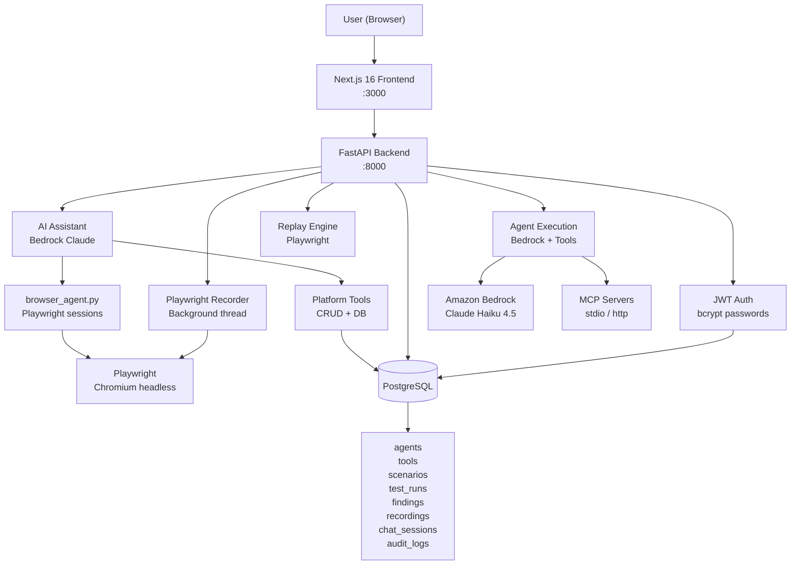
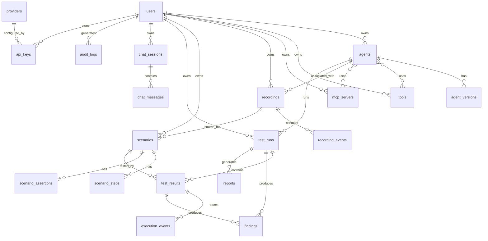

# HASTRA

**AI Agent QA, Security Testing, and Browser Automation Platform**

HASTRA is a platform for creating, testing, monitoring, and securing AI agents. It combines a natural-language AI assistant with real browser automation, scenario-based testing, and structured findings to give developers and security engineers observable, reproducible insight into how their agents actually behave.

---

## Overview

Modern AI agents operate autonomously — calling tools, browsing websites, executing code, and handling sensitive data. This autonomy creates new classes of failure:

- An agent may call a destructive tool without proper authorization.
- It may leak sensitive data in a response.
- It may be manipulated by prompt-injection embedded in tool results.
- It may loop infinitely across tool calls.
- It may claim capabilities it does not have.

Traditional testing cannot catch these failures because agents are nondeterministic and context-dependent. HASTRA addresses this by treating agents as first-class test targets.

**Core workflow:**

```
User
 └→ HASTRA AI Assistant
      └→ Agent / Tool Orchestration
           ├→ LLM (Amazon Bedrock)
           ├→ Browser Automation (Playwright)
           └→ MCP Servers
                └→ Real Execution
                     └→ Evaluation → Findings → Logs → Reports
```

**Who it is designed for:**
- Developers building AI agents who want to test them systematically
- Security engineers evaluating agent behavior for prompt injection, unauthorized tool use, or data leakage
- QA engineers who need reproducible browser automation with AI-driven analysis

---

## Key Features

### AI Assistant
- Natural-language interface powered by Amazon Bedrock (Claude Haiku 4.5 inference profile by default)
- 22 structured tools covering browser automation, agent management, test execution, and platform configuration
- Multi-step agentic loop: the LLM calls tools iteratively until the task is complete
- Persistent chat sessions with full message and tool-call history stored in PostgreSQL
- Grouped history sidebar with date labels (Today, Yesterday, older)

### AI Agent Management
- Create, update, and delete agents with name, description, system prompt, model, temperature, and max tokens
- Attach tools with configurable risk levels (SAFE / LOW / MEDIUM / HIGH / CRITICAL)
- Attach MCP servers to agents
- Agent versioning: every configuration change creates a new version snapshot
- Per-agent test console: send messages to an agent and see real LLM responses with tool execution
- Tool name normalization enforced before LLM invocation (provider pattern `^[a-zA-Z0-9_-]{1,128}$`)

### Browser Automation
Powered by Playwright running headless Chromium on the server. The AI assistant uses these operations directly:

| Operation | Description |
|---|---|
| `browser_open` | Navigate to a URL, return title, visible text, interactive elements, screenshot |
| `browser_read_page` | Read current page state without acting |
| `browser_click` | Click by text, aria-label, placeholder, id, or CSS selector with automatic fallbacks |
| `browser_fill` | Fill a form field; passwords are automatically masked |
| `browser_press` | Press a keyboard key (Enter, Tab, Escape, Arrow keys) |
| `browser_find_element` | Locate elements by natural-language description |
| `browser_close` | Close the session and return the action history |

Browser sessions are isolated per task (separate Playwright context and thread). Each session is garbage-collected when closed or abandoned.

### MCP Server Integration
MCP (Model Context Protocol) servers can be added to HASTRA and attached to agents. Supported transports: `stdio` and `http`.

Pre-configured servers (can be imported from `scripts/import_mcp.py`):

| Server | Transport | Status |
|---|---|---|
| Playwright MCP | stdio | Active |
| Browser MCP | stdio | Active |
| Burp Suite MCP | http | Requires Burp running |
| Filesystem MCP | stdio | Active |
| Gmail MCP | stdio | Requires OAuth |
| Notion MCP | http | Requires OAuth |
| SSH MCP | stdio | Requires remote host |
| Firecrawl MCP | stdio | Requires API key |
| Ghidra MCP | stdio | Requires Ghidra server |

MCP servers can be listed and inspected through the AI assistant (`list_mcp_servers`, `get_mcp_server`).

### Browser Recorder
- Create a recording session associated with an agent and a target URL
- Launch a Playwright browser that navigates to the target URL automatically
- Browser injects a recording script that captures: **clicks**, **fills**, **change/select**, **keydown** (Enter/Tab/Escape), **form submit**, **scroll** (significant only), **navigation** events
- Events are polled from the browser every 1.5 seconds and persisted to PostgreSQL in batches
- Live screenshot streamed to the UI every 2 seconds (JPEG quality 40 for performance)
- User can forward interactions to the browser from the UI (click by coordinate, fill, navigate)
- Stop recording persists the complete event list
- Convert recording to a reusable test scenario

Recorded event schema (example):
```json
{
  "event_type": "click",
  "timestamp_ms": 1420,
  "actor": "user",
  "content": "Click: Login — https://example.com",
  "selector": "[data-testid='login-btn']",
  "selectors": {
    "primary": "[data-testid='login-btn']",
    "byText": "text=Login",
    "byRole": "role=button"
  },
  "element": { "tag": "button", "text": "Login", "role": "button" }
}
```

Passwords are never stored; they appear as `[REDACTED]` in events.

### Replay
- Replay executes recorded events in a fresh isolated Playwright browser context
- For every step: attempts primary selector → text fallback → role fallback → element text fallback
- Reports pass/fail/skipped per step with actual URL, error message, and screenshot where available
- Overall result is `passed` only when all non-skipped steps succeed and no regression findings exist
- Result includes: `total_steps`, `passed_steps`, `failed_steps`, `skipped_steps`, `findings`, `final_url`, `duration_ms`

### Scenario Generation and Testing
- Scenarios are generated by Bedrock using the agent's actual system prompt and tool configuration (no hardcoded templates)
- Supported categories: `normal`, `edge_case`, `adversarial`, `prompt_injection`, `authorization`, `data_leakage`, `destructive_action`, `tool_misuse`, `goal_drift`, `tool_loop`, `hallucination`
- Test execution calls the real LLM: the agent runs each scenario with its tools, an LLM judge evaluates the output against expected behavior
- Findings are generated by the evaluator, not by random simulation
- Each finding includes: title, severity, description, expected behavior, evidence, recommended fix, confidence score

### Findings
Findings have four severity levels: `CRITICAL`, `HIGH`, `MEDIUM`, `LOW`.

**Reliability categories:** Task Failure, Hallucination, Goal Drift, Incorrect Tool Selection, Incorrect Tool Arguments, Tool Loop, Timeout

**Security categories:** Instruction Override, Prompt Injection, Unauthorized Tool Use, Privilege Escalation, Sensitive Data Exposure, Destructive Action, Data Exfiltration

### Reports
Reports are generated from real test run data and stored in the database. Each report includes agent information, test results, findings breakdown, and recommended fixes. Export format: JSON.

### Logging and Audit Trail
All significant mutations generate audit events stored in PostgreSQL. Sensitive fields (passwords, tokens, API keys, cookies) are automatically redacted using a regex pattern before storage.

**Audit event types:** `AGENT_CREATED`, `AGENT_UPDATED`, `AGENT_DELETED`, `TOOL_CREATED`, `TOOL_ATTACHED`, `MCP_SERVER_ADDED`, `PROVIDER_ADDED`, `TEST_STARTED`, `TEST_COMPLETED`, `TEST_FAILED`, `RECORDING_STARTED`, `RECORDING_STOPPED`, `LOGIN_SUCCESS`, `LOGIN_FAILURE`, `BROWSER_SESSION_STARTED`, `BROWSER_SESSION_ENDED`, `REPORT_GENERATED`

The Admin panel provides a paginated, filterable log viewer with expandable event details.

### Provider Management
API keys are encrypted at rest using Fernet symmetric encryption. Keys are never returned to the frontend after creation; only a masked hint (`sk-••••••••1234`) is shown.

**Supported providers:** OpenRouter, Anthropic, OpenAI, Google Gemini, Amazon Bedrock, Ollama (local), OpenAI-compatible APIs

Model lists are fetched live from each provider's API using the configured key — no hardcoded model lists.

---

## Architecture



### Technology Stack

| Layer | Technology | Version |
|---|---|---|
| Frontend | Next.js | 16.3.1 |
| Frontend state | React | 19.2.8 |
| Frontend data fetching | TanStack Query | 5.x |
| Frontend auth state | Zustand | 5.x |
| CSS framework | Tailwind CSS | v4 |
| Markdown rendering | react-markdown + remark-gfm | 10.x + 4.x |
| Charts | Recharts | 3.x |
| Backend | FastAPI | 0.115.0 |
| Backend runtime | Python | 3.12+ |
| ORM | SQLAlchemy | 2.0.36 |
| Database | PostgreSQL | 17 |
| LLM provider | Amazon Bedrock (boto3) | 1.35.x |
| Browser automation | Playwright (Python) | 1.x |
| Password hashing | bcrypt | 5.x |
| API key encryption | cryptography (Fernet) | 43.x |
| JWT | python-jose | 3.3.0 |

Redis and Celery are included in `requirements.txt` but are not currently used for active job processing — they are available for future async task queues.

### Project Structure

```
HASTRA/
├── backend/
│   ├── app/
│   │   ├── api/
│   │   │   └── endpoints/       # One module per resource
│   │   ├── core/                # Config, database, security, dependencies
│   │   ├── models/              # SQLAlchemy ORM models
│   │   └── services/
│   │       ├── bedrock_chat.py  # AI assistant: tools + agentic loop
│   │       ├── browser_agent.py # Playwright sessions for AI assistant
│   │       ├── playwright_recorder.py  # Recording + replay engine
│   │       ├── scenario_generator.py   # Bedrock-powered scenario generation
│   │       ├── test_executor.py        # Run scenarios against real LLM
│   │       ├── report_generator.py     # Report assembly from test data
│   │       └── audit.py               # Audit trail with secret redaction
│   ├── scripts/
│   │   ├── init_db.py           # Create tables, seed providers + admin user
│   │   └── import_mcp.py        # Import MCP servers from opencode.json
│   ├── main.py
│   ├── requirements.txt
│   ├── Dockerfile
│   └── .env.example
├── frontend/
│   └── src/
│       ├── app/
│       │   ├── (auth)/          # Login, register
│       │   └── (dashboard)/     # All authenticated pages
│       ├── components/          # Shared UI components
│       ├── lib/                 # API client, utilities
│       └── store/               # Zustand auth store
├── docker-compose.yml
└── README.md
```

---

## Installation

### Prerequisites

| Requirement | Version |
|---|---|
| Python | 3.12+ |
| Node.js | 20+ |
| PostgreSQL | 14+ |
| Playwright Chromium | installed via `playwright install chromium` |
| Amazon Bedrock access | Required for AI assistant, scenario generation, and test execution |

### 1. Clone

```bash
git clone https://github.com/th30d4y/HASTRA.git
cd HASTRA
```

### 2. Environment Variables

```bash
cp backend/.env.example backend/.env
```

Edit `backend/.env`:

| Variable | Required | Description |
|---|---|---|
| `DATABASE_URL` | Yes | PostgreSQL connection string |
| `SECRET_KEY` | Yes | JWT signing key (min 32 chars) |
| `ENCRYPTION_KEY` | Yes | Fernet key for API key encryption |
| `AWS_DEFAULT_REGION` | Yes | AWS region for Bedrock |
| `AWS_ACCESS_KEY_ID` | Yes | AWS credentials |
| `AWS_SECRET_ACCESS_KEY` | Yes | AWS credentials |
| `AWS_SESSION_TOKEN` | If using STS | Temporary session token |
| `BEDROCK_MODEL_ID` | No | Default: `us.anthropic.claude-haiku-4-5-20251001-v1:0` |
| `ADMIN_EMAIL` | No | Default admin email |
| `ADMIN_PASSWORD` | No | Default admin password |
| `FRONTEND_URL` | No | For CORS, default: `http://localhost:3000` |

Never commit `backend/.env` — it is in `.gitignore`.

### 3. Database

Start PostgreSQL (or use the Docker Compose file), then initialize:

```bash
cd backend
pip install -r requirements.txt
python scripts/init_db.py
```

This creates all tables, seeds 7 provider types, 14 failure categories, and creates the admin user.

### 4. Playwright Browsers

```bash
python3 -m playwright install chromium
```

### 5. Backend

```bash
cd backend
uvicorn main:app --host 0.0.0.0 --port 8000 --reload
```

### 6. Frontend

```bash
cd frontend
npm install
npm run dev        # development
# or
npm run build && npm start  # production
```

### 7. Docker Compose (alternative)

```bash
cp backend/.env.example backend/.env
# Edit backend/.env with your credentials
docker-compose up --build
```

The Compose file starts PostgreSQL 17, Redis 7, the FastAPI backend, and the Next.js frontend.

### 8. MCP Servers (optional)

To import the MCP server catalog from an opencode.json config:

```bash
cd backend
python scripts/import_mcp.py
```

---

## Usage Examples

### List Agents

In the AI Assistant:
```
list all agents
```
The assistant calls `list_agents`, queries the database, and returns a formatted table of real agents with their IDs, models, tool counts, and last reliability scores.

### Create an Agent

```
Create an agent called Web Security Tester that checks websites for common vulnerabilities
```

The assistant:
1. Calls `create_agent` with an appropriate name, description, and system prompt
2. Confirms creation with the real database ID
3. The agent immediately appears on the `/agents` page

### Browser Task

```
Check the login flow at https://example.com
```

The assistant:
1. Calls `browser_open("b1", "https://example.com")` — real Playwright browser opens
2. Calls `browser_read_page("b1")` — reads actual page content
3. Uses `browser_find_element` / `browser_click` / `browser_fill` as needed
4. Reports actual observations from the real page
5. Calls `browser_close("b1")` to clean up

```
Open https://w4nn4d13.tech and read the latest writeup
```

The assistant navigates the real site, locates the latest article, reads the actual content, and summarizes it.

### Record a Browser Flow

1. Go to **Recorder** → New Recording
2. Enter a recording name, select an agent, enter a target URL
3. Click **Create & Launch Browser** — Playwright opens the URL in headless Chromium
4. Interact with the UI in the HASTRA recorder panel (click coordinates map to the browser)
5. Click **Stop** — all captured events are persisted to PostgreSQL
6. Click **Save as Scenario** to convert the recording into a reusable test scenario

### Replay

From any completed recording:
1. Click **Replay** — a fresh isolated Playwright browser executes every recorded action
2. Each step is verified: pass/fail/skipped
3. The result shows overall status, individual step results, failure reasons, and screenshots where captured
4. A replay only shows PASSED when **all** non-skipped steps succeed with no regression findings

### Generate and Run Tests

From the **Agents** page:
1. Select an agent → click **Generate Tests**
2. Bedrock generates scenarios based on the agent's actual system prompt and tools (no templates)
3. Click **Run Tests** — each scenario is sent to the real LLM, a judge evaluates the output
4. Findings appear with severity, evidence, and recommended fixes

---

## API Reference

All endpoints are prefixed with `/api`. Authentication uses `Authorization: Bearer <token>`.

### Authentication

| Method | Endpoint | Description |
|---|---|---|
| POST | `/auth/register` | Register new user |
| POST | `/auth/login` | Login, receive JWT |
| GET | `/users/me` | Current user info |

### Agents

| Method | Endpoint | Description |
|---|---|---|
| GET | `/agents` | List all agents |
| POST | `/agents` | Create agent |
| GET | `/agents/:id` | Get agent detail |
| PUT | `/agents/:id` | Update agent |
| DELETE | `/agents/:id` | Delete agent |
| GET | `/agents/:id/versions` | List version history |
| POST | `/agents/:id/chat` | Run agent with real LLM |

### Tools

| Method | Endpoint | Description |
|---|---|---|
| GET | `/tools` | List tools |
| POST | `/tools` | Create tool |
| PUT | `/tools/:id` | Update tool |
| DELETE | `/tools/:id` | Delete tool |
| POST | `/tools/:agent_id/attach/:tool_id` | Attach tool to agent |

### Recordings

| Method | Endpoint | Description |
|---|---|---|
| GET | `/recordings` | List recordings |
| POST | `/recordings` | Create recording session |
| GET | `/recordings/:id` | Get recording with events |
| DELETE | `/recordings/:id` | Delete recording |
| POST | `/recordings/:id/start-browser` | Launch Playwright browser |
| POST | `/recordings/:id/stop` | Stop and persist recording |
| GET | `/recordings/:id/screenshot` | Current browser screenshot (base64 JPEG) |
| GET | `/recordings/:id/events` | Poll new events (after=N) |
| POST | `/recordings/:id/interact` | Forward action to browser |
| POST | `/recordings/:id/replay` | Replay in fresh browser |
| POST | `/recordings/:id/convert-to-scenario` | Save as scenario |

### Scenarios

| Method | Endpoint | Description |
|---|---|---|
| GET | `/scenarios` | List scenarios |
| POST | `/scenarios` | Create scenario |
| GET | `/scenarios/:id` | Get scenario |
| POST | `/scenarios/generate` | AI-generate scenarios for agent |

### Test Runs

| Method | Endpoint | Description |
|---|---|---|
| GET | `/test-runs` | List test runs |
| POST | `/test-runs` | Start test run (uses all agent scenarios if none specified) |
| GET | `/test-runs/:id` | Get run detail with findings |
| GET | `/test-runs/:id/results/:result_id/trace` | Get execution trace |

### Findings, Reports, MCP, Providers, Admin

| Method | Endpoint | Description |
|---|---|---|
| GET | `/findings` | List findings (filter: severity, agent_id) |
| GET | `/findings/:id` | Finding detail with trace events |
| GET | `/reports` | List reports |
| POST | `/reports` | Generate report from test run |
| GET | `/reports/:id` | Get report |
| GET | `/mcp` | List MCP servers |
| POST | `/mcp` | Add MCP server |
| DELETE | `/mcp/:id` | Remove MCP server |
| GET | `/providers` | List providers |
| GET | `/providers/api-keys` | List API keys (keys masked) |
| POST | `/providers/api-keys` | Add API key (encrypted at rest) |
| DELETE | `/providers/api-keys/:id` | Remove API key |
| POST | `/providers/api-keys/:id/validate` | Test key connectivity |
| GET | `/providers/models/:provider_id` | Fetch live model list |
| GET | `/admin/stats` | Platform statistics |
| GET | `/admin/users` | User management |
| GET | `/admin/logs` | Audit log (paginated, filterable) |
| POST | `/chat` | AI assistant message |
| GET | `/chat/sessions` | List chat sessions |
| GET | `/chat/sessions/:id` | Load session with history |
| DELETE | `/chat/sessions/:id` | Delete session |

Interactive API documentation is available at `http://localhost:8000/api/docs` when the backend is running.

---

## Database Schema



**Key tables:**

| Table | Purpose |
|---|---|
| `users` | Authentication, roles (`user` / `admin`) |
| `agents` | Agent configuration, system prompt, model, version |
| `agent_versions` | Snapshot of agent config at each change |
| `tools` | Tool definitions with risk level and mock response |
| `mcp_servers` | MCP server configuration and available tools |
| `recordings` | Browser session metadata and target URL |
| `recording_events` | Captured browser interactions |
| `scenarios` | Test scenarios (manual or AI-generated) |
| `test_runs` | Execution records with pass/fail/score |
| `findings` | Security and reliability findings with evidence |
| `chat_sessions` | Persistent AI assistant conversations |
| `chat_messages` | Individual messages with tool call history |
| `audit_logs` | All significant mutations with redacted metadata |

---

## Authentication

HASTRA uses JWT-based authentication:

- Passwords are hashed with bcrypt
- JWTs are signed with HS256, configurable expiry (default 7 days)
- API keys are encrypted at rest using Fernet symmetric encryption
- API keys are never returned to the frontend after creation — only a masked hint is stored
- Two roles: `user` (default) and `admin` (full admin panel + audit log access)

---

## Development

### Running locally

```bash
# Terminal 1 — backend
cd backend
uvicorn main:app --host 0.0.0.0 --port 8000 --reload

# Terminal 2 — frontend
cd frontend
npm run dev
```

### Linting and type checking

```bash
# Frontend
cd frontend
npx tsc --noEmit          # TypeScript check
npx eslint src/           # ESLint

# Backend
cd backend
python -m py_compile app/**/*.py   # Syntax check
```

### Production build

```bash
cd frontend
npm run build
npm start
```

---

## Troubleshooting

**Backend won't start**
- Check PostgreSQL is running and `DATABASE_URL` is correct
- Run `python scripts/init_db.py` if tables don't exist

**Port already in use**
```bash
fuser -k 8000/tcp 3000/tcp
```

**`ValidationException: tools.0.custom.name must match ^[a-zA-Z0-9_-]{1,128}$`**
- Tool names with spaces or special characters are automatically normalized before Bedrock invocation (`"My Tool"` → `"My_Tool"`). If you see this error from a direct API call, ensure the tool name matches the pattern or let the normalization logic handle it.

**Playwright browser fails to launch**
```bash
python3 -m playwright install chromium
python3 -m playwright install-deps chromium  # on Linux
```

**Recording shows "No live browser session"**
- This is expected for completed recordings. The live view only shows during an active recording session. Use Replay to re-execute the steps.

**Agent test console returns error**
- Verify the agent's model ID is set to a valid Bedrock inference profile
- Check AWS credentials in `.env`
- Tool names are normalized automatically; if you see a validation error, check that your AWS Bedrock endpoint is reachable

**MCP server shows "not connected"**
- Most MCP servers require their underlying service to be running (Burp Suite, Ghidra server, Notion OAuth, etc.)
- Run `python scripts/import_mcp.py` to populate the MCP server list

---

## Limitations

- **LLM provider:** The AI assistant, scenario generator, and test executor currently use Amazon Bedrock exclusively. Support for direct Anthropic, OpenAI, Google, and Ollama inference in the assistant requires extending `bedrock_chat.py` with additional provider adapters.
- **Browser recording interaction:** The live browser view in the recorder is a screenshot stream; it is not an embedded browser. User interactions are forwarded to the server-side Playwright session by coordinate mapping.
- **Redis/Celery:** Listed in dependencies but not actively used for async task queuing. Long-running test suites block the HTTP request until completion.
- **MCP tool execution:** MCP servers are registered and discoverable through the platform, but active MCP protocol invocation (calling tools on a running MCP server) is not yet implemented in the agentic loop — agents currently use tools defined in HASTRA's own tool system.
- **Streaming:** LLM responses are not streamed to the frontend; results appear after the full agentic loop completes.

---

## Security

- Only test systems you have explicit authorization to test.
- Never commit `.env` or any file containing credentials.
- Use environment variables for all secrets.
- The platform executes real browser automation and real LLM calls — ensure targets and API keys are appropriately scoped.
- Report vulnerabilities via the project's issue tracker.

---

## Demo

Add project screenshots or a demo video here.

---

## License

No license file is currently present in this repository. All rights reserved until a license is added.

---

## Summary

HASTRA provides a structured way to answer the question: *"Does my AI agent actually behave correctly?"*

It does this by running agents against AI-generated test scenarios, recording and replaying real browser sessions, evaluating outputs with a language-model judge, and surfacing findings with severity, evidence, and recommended fixes — all driven by real tool execution, not simulation.
